## Part 1. Installation of the OS
- 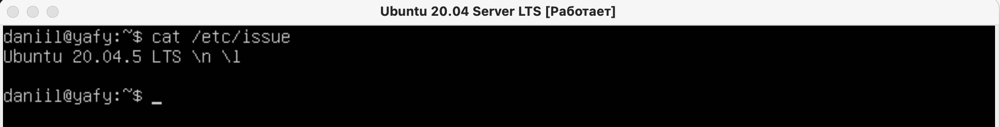
- Вывод версии Ubuntu через команду 
`cat /etc/issue`

## Part 2. Creating a user
- 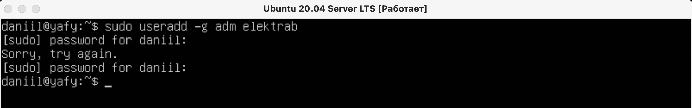
- Создание пользователя через команду 
`sudo useradd -g users username`

- 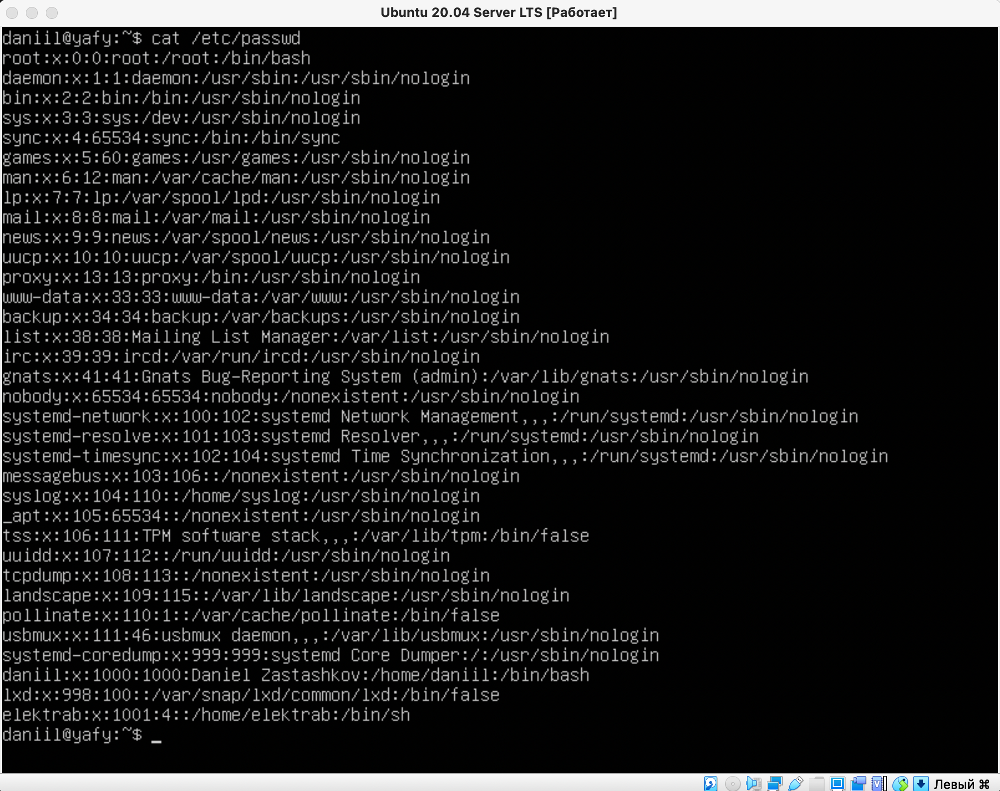
- Вывод команды `cat /etc/passwd`

## Part 3. Setting up the OS network
1. _Изменение имени машины_
- 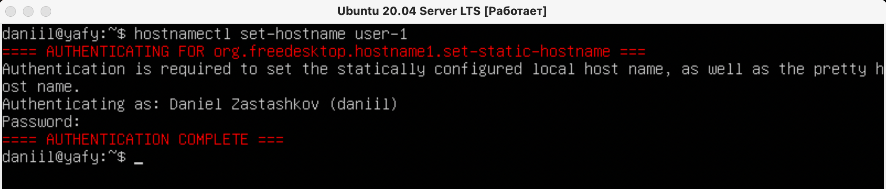
- Для изменения имени используем команду `hostnamectl set-hostname user-1`
Также можно в текстовом редакторе изменить файл hostname

- 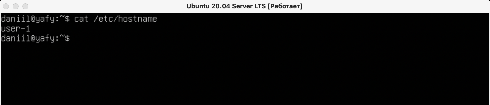
- Чтобы убедиться, что имя было изменено, используем команду
`cat /etc/hostname`

2. _Временная зона_
- 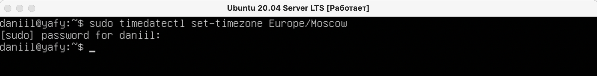
- Для установки временной зоны, соответствующей определенному местоположению,
используем команду `sudo timedatectl set-timezone Europe/Moscow`
- 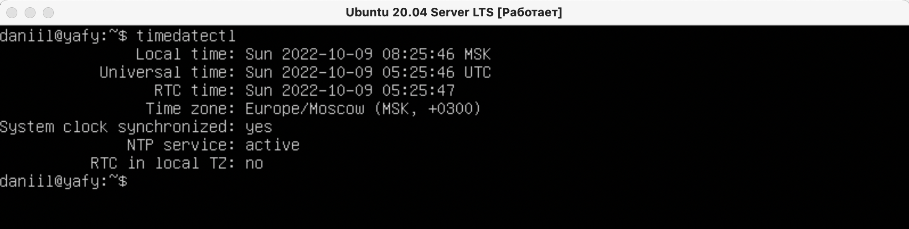
- Чтобы узнать какая временная зона установлена используем команду
`timedatectl`

3. _Сетевые интерфейсы_
- 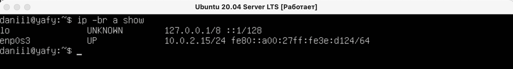
- Для просмотра сетевых интерфейсов используем команду 
`ip -br a show` (_-br brief_ для вывода в кратком виде)
- _lo (loopback device)_ – локальный виртуальный интерфейс, использующийся для отладки сетевых программ и запуска серверных приложений на локальной машине.

4. _DHCP_ 
- 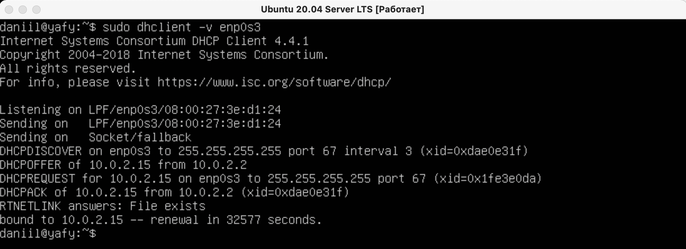
- Чтобы получить IP-адрес текущего устройства от DHCP-сервера используем команду
`sudo dhclient -v interfacename` (в данном случае _enp0s3_)
- DHCP - DynamicHost Configuration Protocol (протокол динамической настройки узла).
- 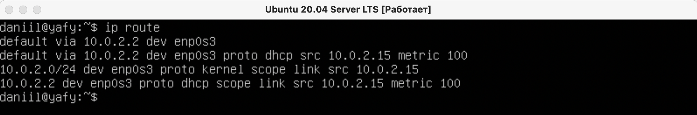
- Проверяем IP командой `ip route`

5. _Внешний, внутренний IP адрес шлюза_ 
- 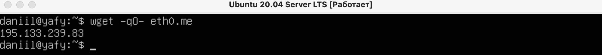
- Для проверки внешнего адреса шлюза используем команду 
`wget -qO- eth0.me`
- 
- Для проверки внутреннего адреса шлюза хватит и
`ifconfig`

6. _Статичные настройки ip, gw, dns_ 
- 
- Чтобы изменить сетевые настройки (ip, gw, dns), заходим в текстовый файл
`sudo vim /etc/netplan/00-installer-config.yaml`

- 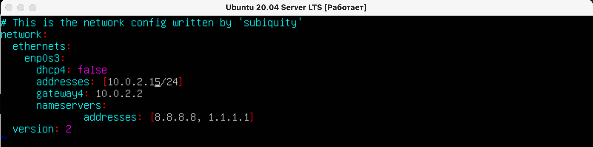
- Отключаем DHCP, добавляем все необходимое

7. _Проверяем настройки_ 
- 
- Для сохранения настроек, используем следующую команду:
`sudo netplan apply`. Если в файле конфигурации есть ошибки, вы увидите сообщение об этом. Используя эту команду, `reboot` делать необязательно. 

- 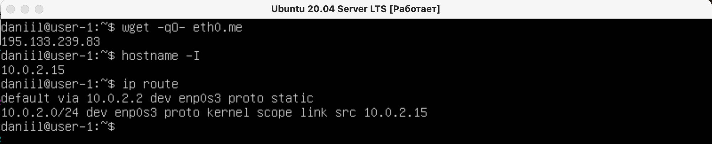
- Проверяем настройки
- 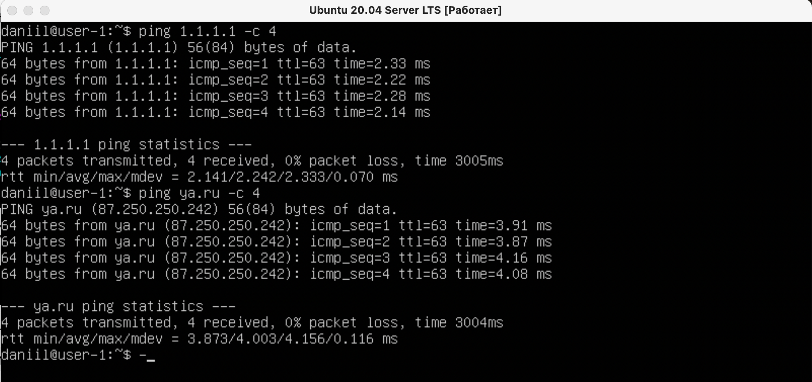
- Используя команду `ping ... -c` проверяем корректность настройки сети. -c нужен для указания количества отсылаемых пакетов.

## Part 4. OS Update
- 
- После ввода команды `sudo apt update` и подтверждения расходования пространства на диске система начнет обновляться

- 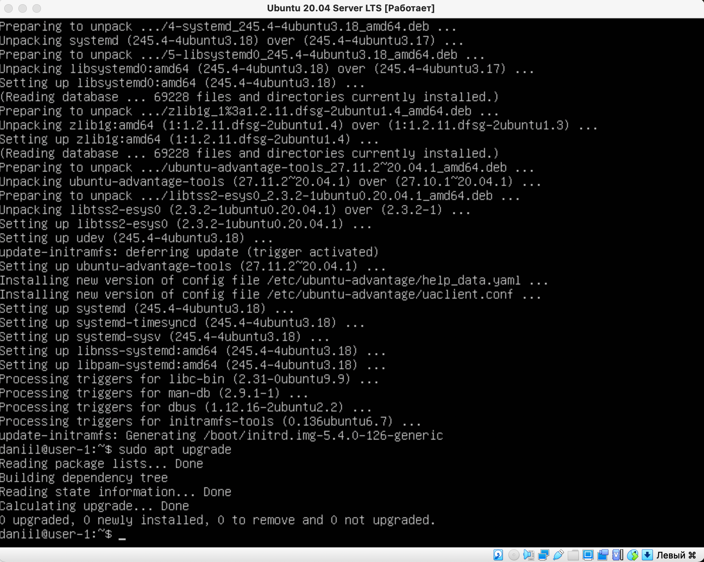
- Вводим команду `sudo apt update`, видим, что доступных обновлений нет

## Part 5. Using the sudo command
- `sudo` - (substitute user and do) позволяет строго определенным пользователям выполнять указанные команды с административными привилегиями&
- 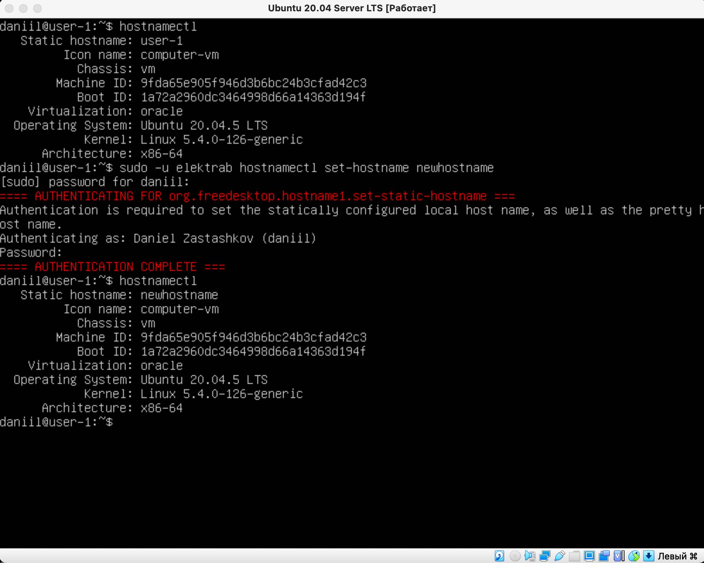
- Чтобы выполнить команду от имени другого пользователя ставим флаг -u. `sudo -u elektrab hostnamectl set-hostname newhostname.`