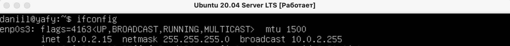
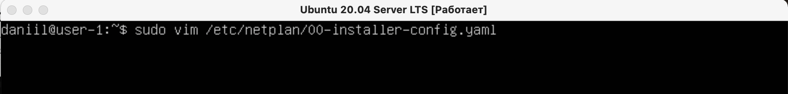
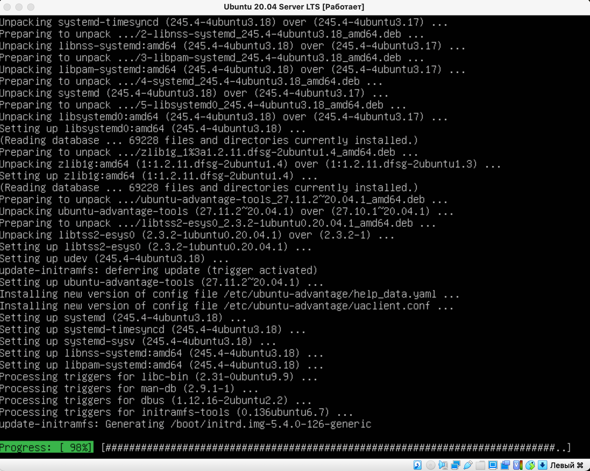
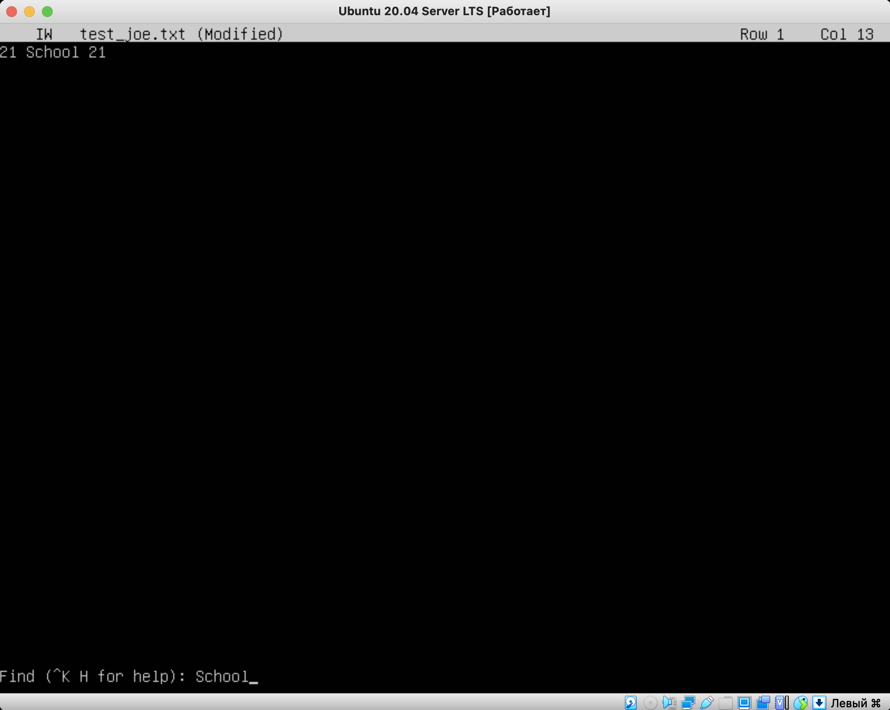
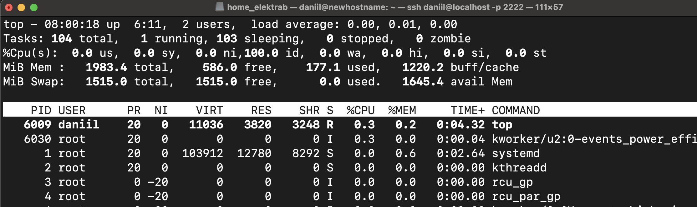
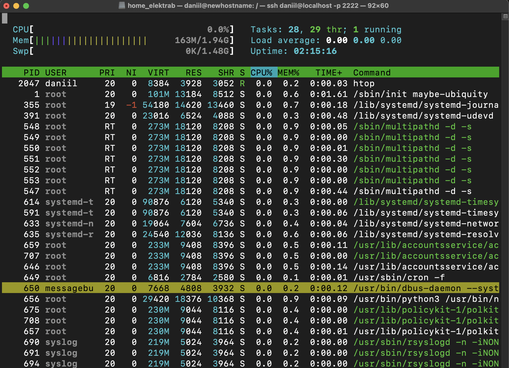

**## Part 1. Installation of the OS
- 
- Вывод версии Ubuntu через команду 
`cat /etc/issue`

## Part 2. Creating a user
- 
- Создание пользователя через команду 
`sudo useradd -g users username`

- 
- Вывод команды `cat /etc/passwd`

## Part 3. Setting up the OS network
1. _Изменение имени машины_
- 
- Для изменения имени используем команду `hostnamectl set-hostname user-1`
Также можно в текстовом редакторе изменить файл hostname

- 
- Чтобы убедиться, что имя было изменено, используем команду
`cat /etc/hostname`

2. _Временная зона_
- 
- Для установки временной зоны, соответствующей определенному местоположению,
используем команду `sudo timedatectl set-timezone Europe/Moscow`
- 
- Чтобы узнать какая временная зона установлена используем команду
`timedatectl`

3. _Сетевые интерфейсы_
- 
- Для просмотра сетевых интерфейсов используем команду 
`ip -br a show` (_-br brief_ для вывода в кратком виде)
- _lo (loopback device)_ – локальный виртуальный интерфейс, использующийся для отладки сетевых программ и запуска серверных приложений на локальной машине.

4. _DHCP_ 
- 
- Чтобы получить IP-адрес текущего устройства от DHCP-сервера используем команду
`sudo dhclient -v interfacename` (в данном случае _enp0s3_)
- DHCP - DynamicHost Configuration Protocol (протокол динамической настройки узла).
- 
- Проверяем IP командой `ip route`

5. _Внешний, внутренний IP адрес шлюза_ 
- 
- Для проверки внешнего адреса шлюза используем команду 
`wget -qO- eth0.me`
- 
- Для проверки внутреннего адреса шлюза хватит и
`ifconfig`

6. _Статичные настройки ip, gw, dns_ 
- 
- Чтобы изменить сетевые настройки (ip, gw, dns), заходим в текстовый файл
`sudo vim /etc/netplan/00-installer-config.yaml`

- 
- Отключаем DHCP, добавляем все необходимое

7. _Проверяем настройки_ 
- 
- Для сохранения настроек, используем следующую команду:
`sudo netplan apply`. Если в файле конфигурации есть ошибки, вы увидите сообщение об этом. Используя эту команду, `reboot` делать необязательно. 

- 
- Проверяем настройки
- 
- Используя команду `ping ... -c` проверяем корректность настройки сети. -c нужен для указания количества отсылаемых пакетов.

## Part 4. OS Update
- 
- После ввода команды `sudo apt update` и подтверждения расходования пространства на диске система начнет обновляться

- 
- Вводим команду `sudo apt update`, видим, что доступных обновлений нет

## Part 5. Using the sudo command
- `sudo` - (substitute user and do) позволяет строго определенным пользователям выполнять указанные команды с административными привилегиями.
- 
- Чтобы выполнить команду от имени другого пользователя ставим флаг -u. `sudo -u elektrab hostnamectl set-hostname newhostname.`

## Part 6. Installing and configuring the time service
- 
- Для синхронизации времени используем команду 
`sudo timedatectl set-ntp 1`. Для отключения вместо 1 ставим 0.

## Part 7. Installing and using text editors
1. **VIM**
- 
- Для того, чтобы начать редактировать содержимое файла нужно нажать `i`. Чтобы сохранить и выйти, необходимо нажать `esc` и набрать `:wq`.

- 
- Для того, чтобы выйти из файла без сохранения изменений необходимо нажать `esc` и набрать `:q!`.

> Квалификатор ! говорит Vim принудительно выполнить операцию.

- 
- Для поиска слова используем конструкцию: `/ word`.

- 
- Для поиска слова и замены его на другое используем конструкцию: 
`:s/wordToFind/wordToReplace`.
- [Статья с описанием всех опций по замене](https://routerus.com/vim-find-replace/#:~:text=%D0%92%20Vim%20%D0%B2%D1%8B%20%D0%BC%D0%BE%D0%B6%D0%B5%D1%82%D0%B5%20%D0%BD%D0%B0%D0%B9%D1%82%D0%B8,%D0%BF%D1%80%D0%BE%D1%81%D1%82%D0%BE%20%D0%BD%D0%B0%D0%B6%D0%BC%D0%B8%D1%82%D0%B5%20%D0%BA%D0%BB%D0%B0%D0%B2%D0%B8%D1%88%D1%83%20%C2%ABEsc%C2%BB.)

2. **NANO**
- 
-  Для выхода жмем `ctrl + x`, после этого nano предложит сохранить файл, пишем "Y".

- 
-  Для выхода жмем `ctrl + x`, после этого nano предложит сохранить файл, пишем "N".

- 
-  Для поиска слова жмем `ctrl + w`, после этого вводим нужное слово и нажимаем `enter`

- 
-  Для поиска слова жмем `ctrl + r`, после этого вводим слово для поиска, нажимаем `enter`, вводим слово, на которое нужно заменить.

3. **JOE**
- 
-  Для выхода жмем `ctrl + k` и нажимаем `q`, *Joe* предложит выбрать сохранять файл или нет, жмем "y".

- 
-  Для выхода жмем `ctrl + k` и нажимаем `q`, *Joe* предложит выбрать сохранять файл или нет, жмем "n".

- 
-  Для того чтобы найти слово жмем `ctrl + k` и нажимаем `f`.

- 
-  Для того чтобы найти слово жмем `ctrl + k` и нажимаем `f`. Далее жмем `R` и вводим слово на которое хотим заменить наше искомое.

## Part 8. Installing and basic setup of the SSHD service
1. Установка
`sudo apt install openssh-server`
2. Автостарт ssh при запуске 
`sudo systemctl enable ssh`
- 
Проверяем через команду `systemctl list-units --type services`:
Для старта службы используем команду:
`sudo systemctl start ssh`

3. 
- Изменяем порт вручную, перейдя в нужный файл, используя команду `sudo vim /etc/ssh/sshd_config`
- Перезапускаем службу командой 
`sudo systemctl restart sshd.service`

4. 
- Для просмотра информации о процессе SSHD используем команду
`ps -FC`
- Флаг -F выдает дополнительные столбы
- Флаг -С выводит информацию по дочерним процессам
- `ps -a` - Просмотр всех запущенных процессов, кроме лидеров групп, в том же режиме отображения, что и в обычном ps:
- `ps -x` - Для просмотра процессов, относящихся именно к вашей учетке
- `ps -f` - Больше столбцов, но не так много как в -F
- `ps -v` - Дополнительные столбцы STAT, MAJFL, TRS и т.д.

5. 
- Результат вывода команды netstat -tan
- Флаг -t - вывод TCP соединений
- Флаг -a - вывод всех портов
- Флаг -n - вывод адресов в числовом виде
Значения столбцов:
- **Proto**: название протокола
- **Recv-Q**: очередь приема. Это входящие байты, которые были получены и помещены в буфер, ожидая, пока локальный процесс, использующий это соединение, прочитает и использует их.
- cSend-Q**:  очередь отправки. Показывает байты, которые готовы к отправке из очереди отправки.
- **Local Address**: локальный IP-адрес участвующий в соединении или связанный со службой, ожидающей входящие соединения (слушающей порт). Если в качестве адреса отображается 0.0.0.0, то это означает - "любой адрес", т.е в соединении могут использоваться все IP-адреса существующие на данном компьютере. Адрес 127.0.0.1 - это петлевой интерфейс, используемый в качестве средства IP протокола для взаимодействия между процессами без реальной передачи данных.
- **Foreign Address**: адрес и номер порта удаленного конца соединения.
- **State**: состояние соединения. Состояние *Listening* говорит о том, что строка состояния отображает информацию о сетевой службе, ожидающей входящие соединения по соответствующему протоколу на адрес и порт, отображаемые в колонке "Локальный адрес ". Состояние *Established* дает понять, что между сервером и клиентом установлено рабочее соединение, позволяющее передавать данные между ними.

## Part 9. Installing and using the top, htop utilities

- **Uptime:** 5:32
- **Количество авторизованных пользователей:** 2
- **Общая загрузка системы:** 0.00, 0.00, 0.00
- **Общее количество процессов:** 104
- **Загрузка cpu:** 0.3 us, 0.3 sy, 0.0 ni, 99.3 id, 0.0 wa, 0.0 hi, 0.0 si, 0.0 st
    + **us:** процент времени, когда ЦПУ был загружен и которое было затрачено на user space (созданные/запущенные пользователем процессы)
    + **sy:** процент времени, когда ЦПУ был загружен и которое было затрачено на на kernel (системные процессы)
    + **ni:** процент времени, когда ЦПУ был загружен и которое было затрачено на приоритезированные пользовательские процессы (системные процессы)
    + **id:** процент времени, когда ЦПУ не был загружен
    + **wa:** процент времени, когда ЦПУ ожидал отклика от устройств ввода - вывода (к примеру, ожидание завершения записи информации на диск)
    + **hi:** процент времени, когда ЦПУ получал аппаратные прерывания (например, от сетевого адаптера)
    + **si:** процент времени, когда ЦПУ получал программные прерывания (например, от какого-то приложения адаптера)
    + **st:** сколько процентов было "украдено" виртуальной машиной - в случае, если гипервизору понадобилось увеличить собственные ресурсы
- **Загрузка памяти:** 1983.4 всего, 586.0 свободно, 177.1 используются
- **pid процесса занимающего больше всего памяти:** 1
- **pid процесса, занимающего больше всего процессорного времени:** 6009
---
- **Htop**
- 
- Сортировка по PID
- 
- Сортировка по PERCENT_CPU
- 
- Сортировка по PERCENT_MEM
- 
- Сортировка по TIME
- 
- sshd процессы
- 
- syslog search
- 
- Через f2 добавляем значения 
- 
- Значения добавлены

## Part 10. Using the fdisk utility
- 
- **Название:** /dev/sda
- **Размер:** 10 GiB, 10737418240 bytes
- **Количество секторов:** 20971520
- **Размер swap:** 1.5 GiB
- 
- ```swapon -s```

## Part 11. Using the df utility
- 
- **размер раздела / составляет:** 8408452 байт
- **размер занятого пространства:** 4860524 байт
- **размер свободного пространства:** 3099212 байт
- **процент использования:** 62 процента

- 
- **размер раздела / составляет:** 8.1G
- **размер занятого пространства:** 4.7G
- **размер свободного пространства:** 3.0 байт
- **процент использования:** 62 процента
- **тип файловой системы:** ext4

## Part 12. Using the du utility
- 
- флаг `-h` для вывода в human-readable стиле
- флаг `-B` для вывода в нужном размере, следующая буква - единица измерения
- флаг `-s` для вывода именно указанных далее директорий

- 
- вывод содержимого папки `/var/log/` через `*`

## Part 13. Installing and using the ncdu utility
- 
- Директория home
- 
- Директория var
- 
- Директория var/log/
- Вывод команды ncdu dirname, в данном случае /home, /var, /var/log.

## Part 14. Working with system logs
